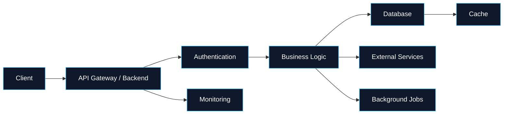

<div align="center">

<!-- HERO -->


<br/>


<br/><br/>

<a href="YOUR_PORTFOLIO_URL">

</a>
&nbsp;
<a href="YOUR_LINKEDIN_URL">

</a>
&nbsp;
<a href="YOUR_EMAIL">

</a>

<br/><br/>


</div>

---

# 👨‍💻 About Me

I'm a **Software Engineer specializing in backend development**, with a focus on building reliable APIs, business logic, integrations, and cloud-ready applications.

I enjoy working close to the engineering fundamentals:

```text
Architecture → APIs → Data → Business Logic → Testing → Deployment
```

### What I focus on

* 🐍 **Python backend engineering**
* ⚙️ **Django & Django REST Framework**
* 🗄️ **SQL & database design**
* 🔐 **Authentication, authorization & RBAC**
* ☁️ **AWS & cloud infrastructure**
* 🐳 **Docker & containerized applications**
* 🧪 **Automated testing with Pytest**
* 🔄 **CI/CD & engineering automation**
* 📡 **Third-party API & service integrations**
* 📊 **Observability, debugging & production reliability**

> I don't just want to write code — I want to understand the system behind it.

---

# 🧠 Engineering Stack

<div align="center">

### Backend


### Databases


### Cloud & DevOps


### Development Tools


</div>

---

# 🏗️ Engineering Capabilities

<table>
<tr>
<td width="50%">

### Backend Engineering

* REST API architecture
* Django / DRF
* Authentication
* RBAC
* Business workflows
* Third-party integrations
* Background processing
* Error handling
* API documentation

</td>

<td width="50%">

### Cloud & DevOps

* AWS services
* Docker
* Linux
* CI/CD
* CloudWatch
* IAM
* Application deployment
* Environment configuration
* Production debugging

</td>
</tr>

<tr>
<td width="50%">

### Database & Data

* PostgreSQL
* MySQL
* Redis
* SQL optimization
* ORM
* Data modeling
* Transactions
* Data validation

</td>

<td width="50%">

### Engineering Practices

* Git workflows
* Pull requests
* Code reviews
* Pytest
* API testing
* Swagger / OpenAPI
* Clean architecture
* Debugging
* Documentation

</td>
</tr>
</table>

---

# 🚀 Featured Work

## 🏥 Healthcare Platform

> Backend engineering for a production healthcare platform.

Worked across backend services, APIs, integrations, authentication,
RBAC, healthcare workflows, reporting, and cloud infrastructure.

### Engineering areas

```text
Django / DRF
     ↓
REST APIs
     ↓
Business Workflows
     ↓
Database
     ↓
Third-Party Integrations
     ↓
AWS Infrastructure
     ↓
Monitoring & Production
```

**Focus:** Backend Architecture • APIs • Integrations • RBAC • AWS • Testing

---

## 🍽️ RR Village Dosa

> Building a product-focused platform around a real-world food business.

The project explores product development from the ground up:

* 📱 Mobile application
* 📍 Location & pincode support
* 🛒 Product workflows
* 🔌 Backend APIs
* 🗄️ Database integration
* 🚀 Deployment

**Focus:** Product Engineering • Mobile • Backend • APIs

---

## 🌐 Developer Portfolio

A modern engineering portfolio designed to showcase:

* Projects
* Technical skills
* Engineering experience
* Product work
* Architecture
* Open-source contributions

**Focus:** Developer Branding • Product Design • Full-Stack Architecture

---

# ⚡ How I Think About Backend Systems



---

# 📈 GitHub Activity

<div align="center">


</div>

<br/>

<div align="center">


</div>

---

# 🐍 Contribution Activity

<div align="center">


</div>

---

# 📊 My Engineering Journey

```text
Python
  │
  ├── Django
  │     └── Django REST Framework
  │             │
  │             ├── APIs
  │             ├── Authentication
  │             ├── RBAC
  │             └── Business Logic
  │
  ├── SQL
  │     ├── PostgreSQL
  │     ├── MySQL
  │     └── Redis
  │
  └── AWS
        ├── Lambda
        ├── ECS / App Runner
        ├── IAM
        ├── CloudWatch
        └── S3
```

---

# 🎯 Currently Exploring

<table>
<tr>
<td align="center" width="25%">

### ☁️

**Cloud Architecture**

AWS
Networking
IAM
Observability

</td>

<td align="center" width="25%">

### 🏗️

**System Design**

Scalability
Caching
Queues
Distributed Systems

</td>

<td align="center" width="25%">

### ⚡

**Performance**

API Optimization
Database Queries
Async Processing

</td>

<td align="center" width="25%">

### 🤖

**AI Engineering**

LLM APIs
AI Integrations
Automation
Agents

</td>
</tr>
</table>

---

# 🧩 Engineering Principles

<div align="center">

| Principle                    | What it means                           |
| ---------------------------- | --------------------------------------- |
| **Keep it simple**           | Prefer understandable solutions         |
| **Build for change**         | Design systems that can evolve          |
| **Test critical paths**      | Protect important business logic        |
| **Observe production**       | Logs and metrics are part of the system |
| **Automate repetitive work** | Let tools handle predictable tasks      |
| **Document decisions**       | Make engineering knowledge reusable     |

</div>

---

# 📚 Learning & Growth

I'm continuously improving across:

```text
Advanced Python
        ↓
Django Internals
        ↓
System Design
        ↓
Distributed Systems
        ↓
AWS Architecture
        ↓
Performance Engineering
        ↓
AI + Backend Integration
```

---

# 🌍 Open Source & Collaboration

I'm interested in collaborating on:

* 🐍 Python projects
* ⚙️ Backend systems
* 🌐 Developer tools
* ☁️ Cloud-native applications
* 🤖 AI-powered products
* 🧰 Developer productivity tools
* 📚 Open-source projects

If you're building something interesting, feel free to connect.

---

# 🤝 Let's Connect

<div align="center">

<a href="YOUR_PORTFOLIO_URL">

</a>

<a href="YOUR_LINKEDIN_URL">

</a>

<a href="mailto:YOUR_EMAIL">

</a>

</div>

<br/>

<div align="center">

### 💡 Build → Learn → Improve → Repeat

<br/>


</div>
