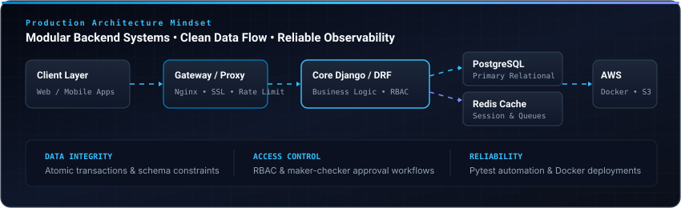
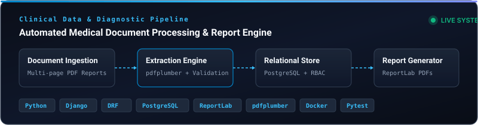
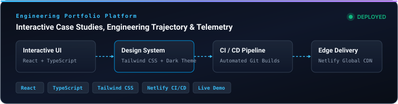
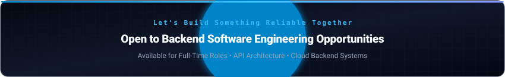

<!-- ========================================================= -->
<!--                    HERO BANNER & HEADER                   -->
<!-- ========================================================= -->

 

<!-- ========================================================= -->
<!--                    DYNAMIC TYPING INTRO                   -->
<!-- ========================================================= -->

  

  <b>PYTHON</b> • <b>DJANGO</b> • <b>DRF</b> • <b>REST APIS</b> • <b>SQL</b> • <b>AWS</b>

  

<!-- ========================================================= -->
<!--                    SOCIAL & PORTFOLIO LINKS               -->
<!-- ========================================================= -->

&nbsp;&nbsp;&nbsp;&nbsp;

&nbsp;&nbsp;&nbsp;&nbsp;

&nbsp;&nbsp;&nbsp;&nbsp;

  

<!-- ========================================================= -->
<!--                    PROFILE STATS COUNTER                  -->
<!-- ========================================================= -->

---

## 👨‍💻 About Me

I am a backend-focused Software Engineer working primarily with **Python, Django, Django REST Framework, SQL, and AWS**. I build practical web services, integrate third-party APIs, design reliable database workflows, and verify software through testing and structured logging.

My experience includes building role-based access control (RBAC) layers, automating PDF report generation and extraction pipelines, and containerizing applications with Docker for cloud deployment.

---

## 🛠️ Tech Stack

| Category | Technologies |
| :--- | :--- |
| **Backend** | **Python** · **Django** · **Django REST Framework (DRF)** · RESTful APIs · *(Secondary: Flask)* |
| **Databases** | **PostgreSQL** · MySQL · Redis · SQL Optimization |
| **Cloud & DevOps** | **AWS** (EC2, S3, IAM, CloudWatch) · **Docker** · Linux · GitHub Actions |
| **Testing & Tools** | **Pytest** · Swagger / OpenAPI · Postman · Git · GitHub · Bash |

 

  

---

## 🏗️ Engineering Capabilities

<table>
<tr>
<td width="50%" valign="top">

### ⚙️ Backend
* **REST APIs:** Structured resource endpoints, request validation, serializers, and HTTP response standards.
* **Frameworks:** Core architecture with Django and Django REST Framework; supplementary experience with Flask.
* **Access Control:** Role-Based Access Control (RBAC) and maker-checker approval workflows.
* **Document Processing:** Dynamic PDF generation (`ReportLab`) and automated extraction (`pdfplumber`).

</td>
<td width="50%" valign="top">

### 🗄️ Data
* **Database Modeling:** Relational schema design with PostgreSQL and MySQL.
* **ORM & SQL:** Query optimization using `select_related` / `prefetch_related` to prevent N+1 queries.
* **Caching:** In-memory caching and session handling using Redis.
* **Data Integrity:** Foreign key constraints, atomic transactions, and migration management.

</td>
</tr>
<tr>
<td width="50%" valign="top">

### ☁️ Cloud & Infrastructure
* **Containerization:** Multi-stage Docker packaging for reproducible application builds.
* **AWS Services:** Experience with EC2 instances, S3 storage, IAM permission policies, and CloudWatch logs.
* **Server Environment:** Linux system navigation, process management, and Bash automation.
* **CI/CD:** Automated testing workflows with GitHub Actions.

</td>
<td width="50%" valign="top">

### 🧪 Quality & Reliability
* **Automated Testing:** Writing unit and integration tests using Pytest.
* **API Documentation:** OpenAPI and Swagger specifications for clean frontend-backend contracts.
* **Observability:** Centralized logging, error tracing, and request debugging.
* **Code Review & Git:** Feature branch workflows, pull requests, and commit hygiene.

</td>
</tr>
</table>

 

  

---

## 🚀 Featured Projects

### 🏥 Healthcare Clinical Platform & Document Pipeline
Clinical data platform designed to process medical reports and generate structured patient summaries.

 

  

* **Built with:** Python · Django · Django REST Framework · PostgreSQL · Docker · ReportLab · pdfplumber · Pytest
* **What I Built:** Developed RESTful endpoints for clinical record access, implemented automated medical PDF report generation with `ReportLab`, and built diagnostic document parsing pipelines with `pdfplumber`.
* **Technical Problem Solved:** Automated extraction and structured compilation of multi-page medical test results into standardized database records, removing manual transcription steps.
* **Workflows & Security:** Role-Based Access Control (RBAC) for practitioner data segregation, PostgreSQL relational modeling, and automated Pytest test suites.
* **Links:** [Portfolio Case Study](https://nmanikumar.netlify.app) • [GitHub Profile](https://github.com/ManiKumar208)

---

### 🌐 Personal Developer Portfolio Platform
Responsive personal web platform showcasing engineering trajectory, production case studies, and live projects.

 

  

* **Built with:** React · TypeScript · Tailwind CSS · Netlify CI/CD
* **What I Built:** Interactive, accessible portfolio interface highlighting software systems, architecture notes, and work history.
* **Technical Problem Solved:** Fast page loads, mobile responsiveness, and continuous deployment via Netlify Git integration.
* **Links:** [Live Site](https://nmanikumar.netlify.app) • [GitHub Profile](https://github.com/ManiKumar208)

 

> 💡 **Component Implementation:** An interactive React showcase component for this engineering profile is available in [`src/DeveloperProfileShowcase.jsx`](./src/DeveloperProfileShowcase.jsx).

---

## 📊 GitHub Analytics

&nbsp;

---

## 🎯 Currently Exploring

* **Cloud Architecture:** Deepening knowledge of AWS infrastructure patterns, security policies, and container orchestration.
* **System Design:** Studying high-throughput API patterns, queue-based decoupling, and caching architectures.
* **Backend Performance:** Database query profiling, connection pooling, and asynchronous task execution.
* **AI & Document Workflows:** Integrating LLM APIs for automated document analysis and structured data extraction.

---

## 🧩 Engineering Principles

* **Simplicity First:** Prefer straightforward, readable code over unnecessary abstractions.
* **Contract Rigor:** Treat APIs and database schemas as strict contracts with clear validation.
* **Automated Verification:** Write tests for core business logic and critical paths.
* **Observability:** Make system failures visible and diagnosable through structured logging.
* **Pragmatic Automation:** Automate repetitive testing, packaging, and deployment tasks.

---

## 🤝 Let's Connect

 

  

 

I am actively open to **Software Engineer** and **Backend Developer** opportunities, technical discussions, and collaborative projects. Feel free to reach out across any of these channels:

<table>
<tr>
<td width="50%" valign="top">

### 🌐 Personal Portfolio
Explore interactive project case studies, live demos, and my engineering trajectory.
* **Direct URL:** [nmanikumar.netlify.app](https://nmanikumar.netlify.app)

 

</td>
<td width="50%" valign="top">

### 💼 LinkedIn Profile
Connect for professional networking, engineering discussions, and role inquiries.
* **Direct URL:** [linkedin.com/in/manikumarnakka](https://www.linkedin.com/in/manikumarnakka/)

 

</td>
</tr>
<tr>
<td width="50%" valign="top">

### ✉️ Direct Email
Send me an email for opportunities, consultations, or technical questions.
* **Direct Address:** [narayanamanikumar2004@gmail.com](mailto:narayanamanikumar2004@gmail.com)

 

</td>
<td width="50%" valign="top">

### 🐙 GitHub Repositories
Explore source code, active implementations, and technical backend architectures.
* **Direct URL:** [github.com/ManiKumar208](https://github.com/ManiKumar208)

 

</td>
</tr>
</table>

 

  <b>BUILD</b> • <b>OPTIMIZE</b> • <b>TEST</b> • <b>DEPLOY</b> • <b>SCALE</b>

